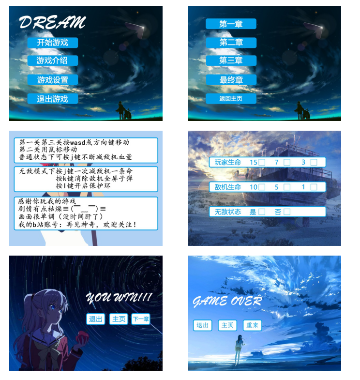
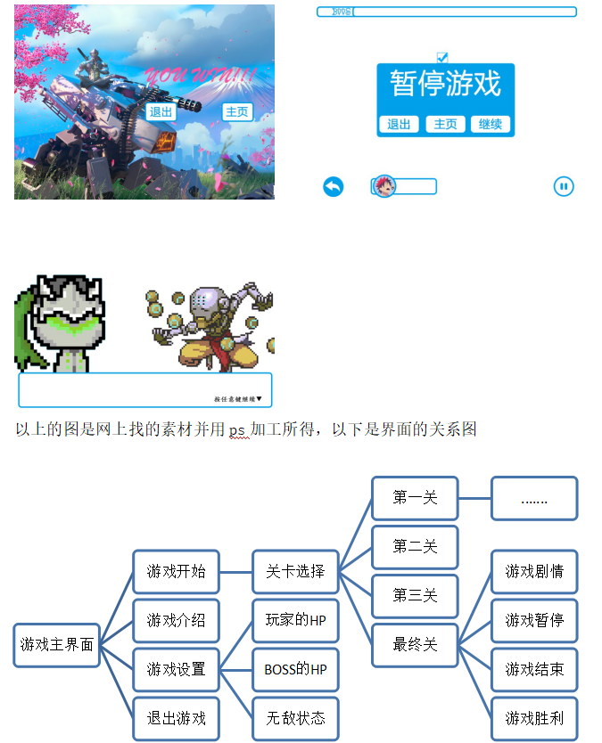

# Cola_dream
### 1.程设大作业，使用C语言库easyX做的小游戏

[EasyX是针对 C++ 的图形库]: https://easyx.cn/
[b站演示视频]: https://www.bilibili.com/video/av25043844

如果想要运行可以直接clone exe文件夹，里面有可运行文件

如果想要运行工程，src是vs工程，双击Cola_dream.sln打开

（若要编译运行听音乐，把exe\music里的音频复制到src\Cola_dream\music以及src\Release\music中)

### 程序主界面如下

